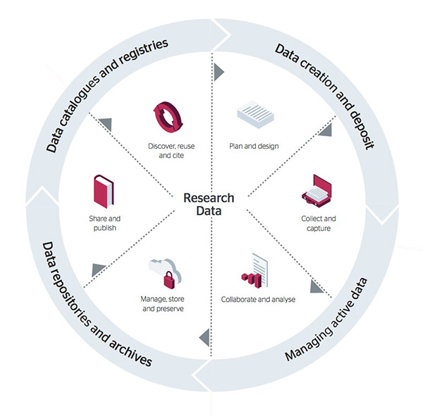

.. SNIC iRODS User Documentation documentation master file, created by
   sphinx-quickstart on Thu Mar 16 11:24:26 2017.
   You can adapt this file completely to your liking, but it should at least
   contain the root `toctree` directive.

SNIC Swestore Documentation
=========================================================

About Swestore
```````````````

Swestore is National Research Data Storage Infrastructure operated by the Swedish National Infrastructure for Computing (`SNIC <http://www.snic.se>`_). 

The resources provided by Swestore are made available through open procedures such that the best Swedish research is supported and new research is facilitated. The purpose of Swestore allocations, granted by Swedish National Allocations Committee (`SNAC <http://www.snic.vr.se/snic-committees/snac>`_), is to provide large scale data storage for “live” or “working” research data, also known as **active research data**.




            Research data lifecycle diagram - showing the different stages a package of research may have to pass through and broadly points to the services and systems institutions will need to put in place in order to support their researchers' data management (©Jisc and Bonner McHardy [CC BY-NC-ND])

Due to the current funding model, allocations made available through open procedures and granted by SNAC are intended for **"Managing of active data"**. This type of allocations on Swestore have some usage limitations unless specifically stated otherwise in separate contract:

 * Swestore allocations are NOT supposed to be used for backups and such requests for allocation will be rejected. Please, check with your university (home institution/organisation) IT department about backup services, strategies and policies in place. If such services do not exist or if you can’t access them for different reasons, please contact us at support@swestore.se;
 * Swestore is NOT supposed to be used as archiving service, long-term storage or repository for “static” data. Once data is no longer in the process of change, and decision on which data should be retained shared and/or preserved has been taken, data should be moved toward appropriate data services. The higher education institutions are responsible for archiving and long-term preservation of research data produced by researchers employed by them;
 
If you would like to purchase SNIC Storage services and/or Swestore storage allocation, please contact SNIC Office at office@snic.se 

.. toctree::
   :maxdepth: 2
   :caption: Contents:

   Apply_for_storage 
   Swestore_dCache
   Swestore_iRODS
   Grid_certificates
   Support
   Glossary

Indices and tables
==================

* :ref:`genindex`
* :ref:`modindex`
* :ref:`search`
